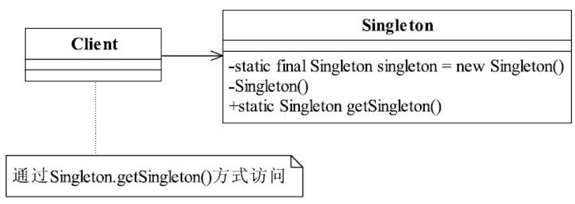

# 7 单例模式

单例模式（Singleton Pattern）是一个比较简单的模式，其定义如下：

Ensure a class has only one instance, and provide a global point of access to it.（确保某一个类只有一个实例，而且自行实例化并向整个系统提供这个实例。）

单例模式的通用类图如图。

<div align=center>


懒汉模式

```go
//定义单例
type Singleton struct {
}
//懒汉在初始化时进行实例
var singlenton  = new(Singleton)
//获取实例
func getInstance() *Singleton {
	return singlenton
}
```

饿汉模式

```go
var singlenton  *Singleton
//获取实例
func getInstance() *Singleton {
	if singlenton == nil {
    //先不创建，需要再创建
		fmt.Println("饿汉初始化创建")
		singlenton = new(Singleton)
	}
	return singlenton
}
```


多携程情况下饿汉模式

```go
//获取实例
var singlenton  *Singleton
var lock *sync.Mutex = &sync.Mutex{}

func getInstance3() *Singleton {
	if singlenton == nil {
		lock.Lock()
		defer lock.Unlock()
		fmt.Println("饿汉初始化创建")
		singlenton = new(Singleton)
	}
	return singlenton
}
```

