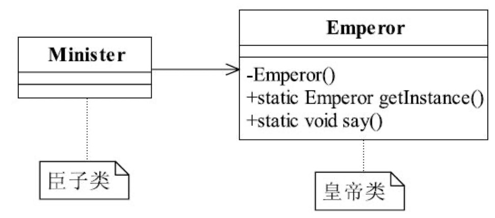

### 7.1单例皇帝

​			皇帝每天要上朝接待臣子、处理政务，臣子每天要叩拜皇帝，皇帝只能有一个，也就是一个类只能产生一个对象，该怎么实现呢？对象产生是通过new关键字完成的（当然也有其他方式，比如对象复制、反射等），这个怎么控制呀，但是大家别忘记了构造函数，使用new关键字创建对象时，都会根据输入的参数调用相应的构造函数，如果我们把构造函数设置为private私有访问权限不就可以禁止外部创建对象了吗？臣子叩拜唯一皇帝的过程类图如图所示。

<div align=center>

懒汉实现叩拜

```go
package main

import "fmt"

//定义皇帝结构体
type Emperor struct {
}
//定义说话方法
func (E *Emperor) say() {
	fmt.Println("我就是皇帝某某某")
}

//懒汉在初始化时进行实例
var emperor *Emperor
func init() {
	fmt.Println("初始化一个皇帝")
	emperor = new(Emperor)
}
//获取实例
func getInstance() *Emperor {
	return emperor
}

//实现多人对一皇帝叩拜
func main() {
	for i := 0; i < 10; i++ {
		e := getInstance()
		e.say()
	}
}
```

